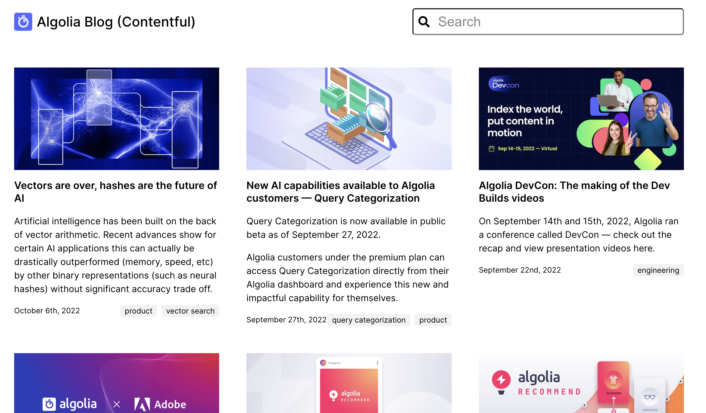

# Algolia Contentful Blog Demo

**Live Demo**: https://algolia-contentful-blog.netlify.app/



## Features

- The demo is a subset of the Algolia blog
- Front-end built using [Gatsby](https://github.com/contentful/starter-gatsby-blog), React, React Instantsearch
- Real-time create / update / delete of content via Contentful webhooks
	- **Vidyard**: http://video.algolia.com/watch/Lzh2nCDH2Bw7WRBi1tzFWU


## Getting started

### Get the source code and install dependencies.

```
$ git clone https://github.com/kxu-algolia/contentful-blog-demo
$ npm install
```

### Set up of the needed content model and create a configuration file

This project comes with a Contentful setup command `npm run setup`.

This command will ask you for a space ID, and access tokens for the Contentful Management and Delivery API and then import the needed content model into the space you define and write a config file (`./.contentful.json`).

`npm run setup` automates that for you but if you want to do it yourself rename `.contentful.json.sample` to `.contentful.json` and add your configuration in this file.

## Crucial Commands

### `npm run dev`

Run the project locally with live reload in development mode.

### `npm run build`

Run a production build into `./public`. The result is ready to be put on any static hosting you prefer.

### `npm run serve`

Spin up a production-ready server with your blog. Don't forget to build your page beforehand.

